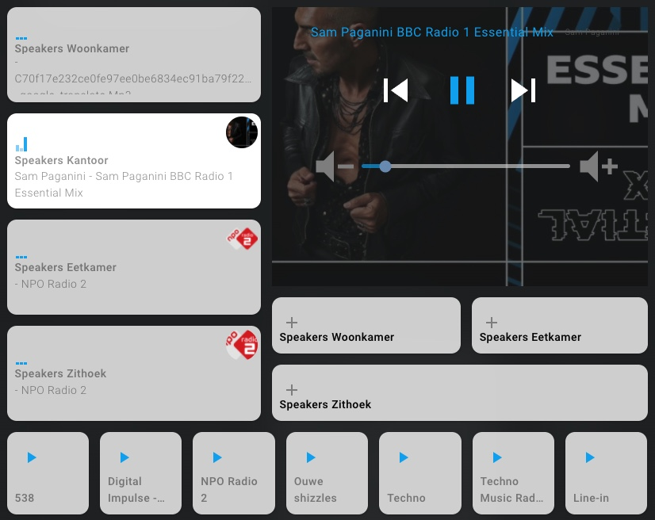

# Sonos custom card
Customize media player for sonos speakers!<br>
Heavily based on https://github.com/DBuit/sonos-card<br>

## Features:

* Group/Ungroup speakers
* Control multiple speaker
* Play favorites from list



<details>
  <summary><b>Example lovelace yaml:</b></summary>

```yaml
views:
- title: "Sonos"
    icon: mdi:speaker
    id: muziek
    panel: true
    cards:
      - type: "custom:custom-sonos-card"
        name: "Sonos"
        entities:
          - media_player.player1
          - media_player.player2
```

This card requires `type: module`.
```yaml
resources:
  - url: /local/custom-sonos-card.js?v=1.0
    type: module
```

</details>

